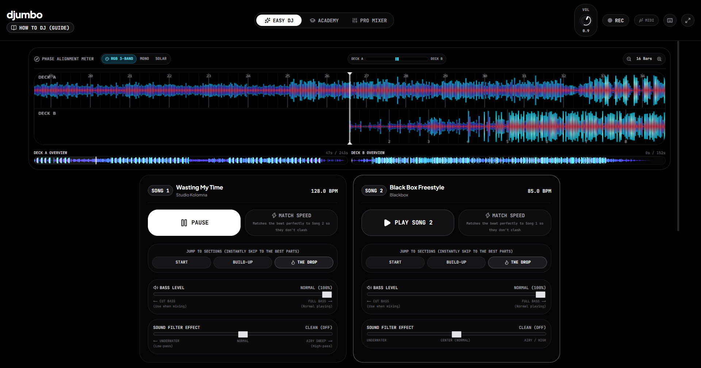

# Djumbo



> **The Easy & Powerful Browser DJ Studio**  
> Club-grade dual-deck web mixing console with real-time Web Audio DSP, 60 FPS multi-band RGB waveforms, Web Worker audio analysis, interactive DJ Academy, and YouTube streaming crate.

---

## Highlights & Capabilities

- **Dual-Deck Mixing Engine:** True Web Audio node graph with Isolator EQs (Low, Mid, High with -∞ kill toggles), variable-resonance High-Pass & Low-Pass filters, and assignable crossfader curve modes (Smooth / Scratch / Linear).
- **Pioneer CDJ-3000 Style RGB Waveforms:** 3-band spectral waveforms separating **Highs (Cyan)**, **Mids (Emerald)**, and **Lows/Bass (Crimson)** with interactive zoom and hot cue flag markers.
- **60 FPS Hardware-Accelerated Performance:**
  - Offloaded background Web Worker for waveform peak extraction and autocorrelation BPM detection.
  - Zero-React-overhead HTML5 `<canvas>` VU meters and direct DOM jog wheel platter rotations.
  - Granular component-level memoization (`React.memo`) preventing audio thread dropouts.
- **Interactive DJ Academy & Beginner Simple Mode:** Step-by-step guided interactive lessons, phrase matching guides, and auto-transition magic.
- **Turbo YouTube Streaming (10x Faster):** Search or paste any YouTube URL to stream directly into Deck A or B (powered by `yt-dlp`). Utilizes server-side caching for instantaneous 0ms reloading and automatic BPM & key calculation.
- **Performance Pads & FX Rack:** Hot Cues (1–8), Auto-Looping (1/16 to 32 beats), Beat Jumps, Beat Rolls, Filter Sweeps, Tempo-Synced Delay/Echo, and Flanger.
- **DJ Soundboard:** Instant sound triggers (Airhorns, Lasers, Sirens, Sub-drops, Vinyl Backspins).
- **Modular Layout Management:** Hide/show major UI components (Waveforms, FX Racks, Soundboard, Phrase Bar, and Track Library) for a personalized, distraction-free performance space.
- **Web MIDI Controller Integration:** Plug-and-play USB/Bluetooth DJ hardware controller mapping with auto-discovery.
- **Progressive Web App (PWA):** Installable standalone audio workstation for desktop and tablet.

---

## Getting Started

### Prerequisites

- Node.js 18.17+ or Node.js 20+
- npm, pnpm, or yarn

### Installation

```bash
# Clone the repository
git clone
cd djumbo

# Install dependencies
npm install

# Run the local development server
npm run dev
```

Open [http://localhost:3000](http://localhost:3000) in your browser.

### Production Build

```bash
npm run build
npm run start
```

---

## Project Architecture

```
djumbo/
├── public/                 # Static assets and royalty-free preloaded audio tracks
├── src/
│   ├── app/                # Next.js App Router (Layout, Page, PWA Manifest, YouTube API)
│   ├── components/         # Modular DJ UI components (Deck, Mixer, Waveforms, FX, Academy)
│   └── lib/
│       ├── audio/          # Core Web Audio DSP engine, Track Analyzer Worker, Soundboard & MIDI
│       └── types/          # Strict TypeScript interfaces for DJ states and audio parameters
├── _docs/                  # Architecture specs, changelog, API contracts, and consistency guidelines
├── .gitignore              # Production Git ignore rules
└── package.json            # Project manifest
```
